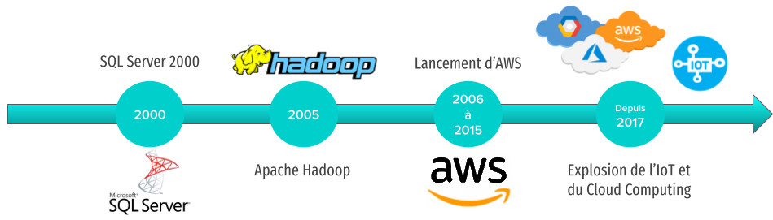
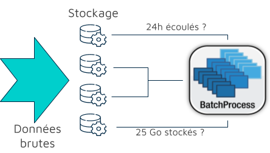
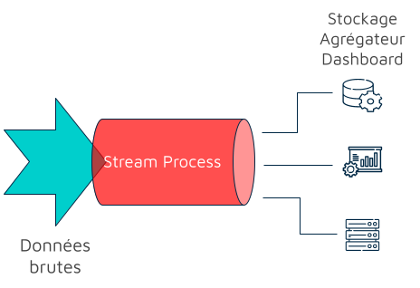
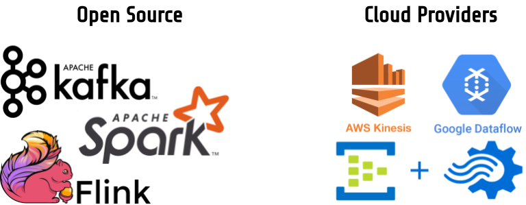

<link rel="shortcut icon" type="image/x-icon" href="favicon.ico">

### De gigantesques flux de données 

Depuis plus de 10 ans, la production et l'exploitation de données connaissent une croissance vertigineuse. Si les volumes de données sont souvent évoqués, la nature des données est devenue très diversifiée et oblige à mettre en place de nouvelles stratégies de traitement.

A titre d'exemple, le Big Data c'est:
- Environ 50 milliards d'objets connectés dans le monde
- 150 milions de mails envoyés chaque minute
- 463 exaoctets de données générées par jour (1 exacotet = 10^9 gigaoctets)
- 2,3 millions de recherches Google chaque minute
- 70 000 heures de streaming sur Netflix chaque minute

Mais le Big Data, c'est aussi une promesse...

> *La capacité à traiter des données rapidement permet de prendre les meilleures décisions*

Ainsi, on a vu se développer des technologies et des infrastructures de calcul de plus en plus performantes et de moins en moins chères.

### Des évolutions technologiques

Si au début du siècle, le traitement de données était réservé aux technologies de bases de données, l'évolution technologique permet de constater l'effort qui a été entrepris pour répondre aux besoins de stockage et de traitement croissants des données.

L'écosystème Hadoop bâtit autour du framework éponyme est le premier à proposer une solution pour le stockage et le traitement distribué. Basé sur un [papier de recherche](https://static.googleusercontent.com/media/research.google.com/fr//archive/mapreduce-osdi04.pdf) de Google, Hadoop met en oeuvre le paradigme *map-reduce*. Hadoop est aujourd'hui un pilier des architectures Big Data et un large écosystème s'est établi autour de la solution originelle. 

Dans un second temps, devant la complexité des architectures Big Data et constatant les potentialités liées à l'exploitation des données, l'accent a été mis sur l'accessibilité et la maîtrise des coûts. C'est pourquoi à partir de 2010, on voit apparaître des solutions en mode cloud qui permettent de déployer des systèmes complets de gestion de données en délégant une partie de la complexité aux fournisseurs de ces services. Les principaux fournisseurs sont en 2022 
- *Amazon Web Services*
- *Microsoft Azure*
- *Google Cloud Platform*

### Du temps-réel ? Pourquoi faire ?

#### Logique de traitement

C'est dans ce contexte que sont apparues les technologies dites temps-réel. Si auparavant, les données étaient d'abord stockées puis traitées en blocs, face aux flux grandissants, le temps-réel tente d'opérer au plus tôt les traitements. L'objectif est de valoriser la donnée au plus vite mais aussi la tenue à jour. 

Ainsi, dans une logique temps-réel les flux de données sont directement traités puis peuvent:
- alimenter des couches applicatives
- être redirigés vers d'autres transformateurs
- être stockés

#### Un flux c'est quoi ?

Hormis le changement dans le paradigme de traitement, c'est bien la nature des données elles-mêmes qui a amené ces changements. Auparavant, les données parvenaient de manière ponctuelle et dans la plupart du temps, sous forme d'entités atomiques au système de gestion. Lors d'un traitement temps-réel, l'entité atomique est le flux: il peut être vu comme une structure infinie et continue transportant de l'information. Un flux n'est donc pas sécable et deverse son contenu en continu. 

### Quelles technologies pour le temps-réel ? 

Les *Cloud Providers* ont bien sûr mis en place de nombreuses solutions pour répondre aux enjeux du temps-réel. Performantes et adaptables, c'est aujourd'hui les solutions préférées par les entreprises en raison de la simplicité d'intégration et de déploiement. Pourtant, la plupart de ces solutions reposent sur des solutions *open source*. 

